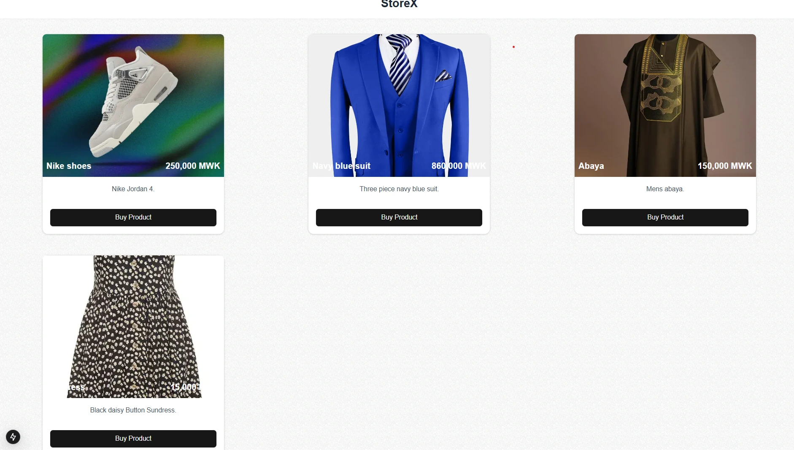

# PayChangu Integration with Popup (Next.js)

This project demonstrates how to integrate PayChangu, a payment gateway platform for Malawi, into a Next.js application with a payment form and a PayChangu popup. The integration allows users to make payments directly from a dynamic payment form. The integration includes the necessary API calls and configurations for both initiating and verifying payments.

**Key Features**:
- Payment form with customer details (first name, last name, email).
- Popup integration with PayChangu for payment processing.
- Payment verification using PayChangu's API.
- Screenshots of the homepage, payment form, and PayChangu popup for visualization.

## Table of Contents
- [Getting Started](#getting-started)
- [Installation](#installation)
- [Usage](#usage)
- [Paychangu Popup](#PayChangu-Popup)
- [Checkout Function](#checkout-function)
- [Verify Transaction Function](#verify-transaction-function)
- [Important Notes](#important-notes)
- [Screenshots](#screenshots)
- [License](#license)

## Getting Started

### Prerequisites
- Node.js (v14 or higher)
- npm or Yarn
- PayChangu Merchant Account

### Installation
Clone the repository:
```bash
git clone https://github.com/SentinalX1/Paychangu-test.git
```
Navigate to the project directory:
```bash
cd Paychangu-test
```
## Install dependencies:

npm install
# or
yarn install

## Usage:
To start using this project, make sure you have set the correct callbackUrl and returnUrl values in your payment form. These URLs are required for the payment process to work. For testing purposes, you can use https://webhook.site/ to generate temporary URLs.

## PayChangu Popup
In order for the PayChangu popup to appear when the user submits the payment form, it is important to include the necessary wrapper element in the PaymentForm component. This wrapper ensures that the PayChangu SDK can load and display the payment popup.

```typescript
{showPopup && (
  <div id="wrapper">
    {/* PayChangu popup will render here */}
  </div>
)}

```
The wrapper is located in the Payment-Form component and is necessary for the popup functionality:

## Checkout Function
The checkout() function initiates a payment by sending a request to PayChangu's Level API and redirects the user to the checkout URL.

Location: lib/actions/actions.ts

## Function Signature:
```typescript
export async function checkout(values: z.infer<typeof formSchema>): Promise<string | null>;
```
## Usage:
```typescript
import { checkout } from "@/lib/actions/actions";

const paymentDetails = {
  firstname: "John",
  lastname: "Doe",
  email: "john.doe@example.com",
  amount: amount: Number(product.Amount) || 0,
  currency: "MWK",
  callbackUrl: "https://yourdomain.com/api/finalize-payment",
  returnUrl: "https://yourdomain.com/payment-success",
};

await checkout(paymentDetails);
```
## This function:
Generates a unique transaction reference (tx_ref).
Sends the payment details to the PayChangu API.
Returns the checkout URL for redirection.
Verify Transaction Function
The verifyTransaction() function checks the status of a transaction using the tx_ref.

Location: lib/payment-helpers.ts

## Function Signature:
```typescript
export async function verifyTransaction(tx_ref: string): Promise<string>;
```
## Usage:
```typescript
import { verifyTransaction } from "@/lib/payment-helpers";
const status = await verifyTransaction(tx_ref);
```
## This function:
Sends a GET request to https://api.paychangu.com/verify-payment/${tx_ref}.
Returns the transaction status (e.g., "success", "failed").

## Important Notes
Callback and Return URLs: The callbackUrl and returnUrl are required to complete the payment process. You can generate these URLs for testing purposes using Webhook.site.

PayChangu SDK: The PayChangu SDK is dynamically loaded in the app to handle the popup. Make sure to include the correct PayChangu public key for production use.

Popup Visibility: The PayChangu popup is shown after the user submits the payment form. The visibility of the popup is managed through the showPopup state.

# Screenshots

Homepage: 

Payment Form: 

PayChangu payment Popup: 

PayChangu Visa process: 

PayChangu Mobile payment options: 

Success page: 

## License

This project is licensed under the **MIT License**. You are free to use, modify, and distribute the code in your own projects, subject to the following conditions:

- You must include a copy of this license in all copies or substantial portions of the code.
- The software is provided "as is", without warranty of any kind, express or implied, including but not limited to the warranties of merchantability, fitness for a particular purpose, or noninfringement.
